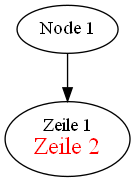
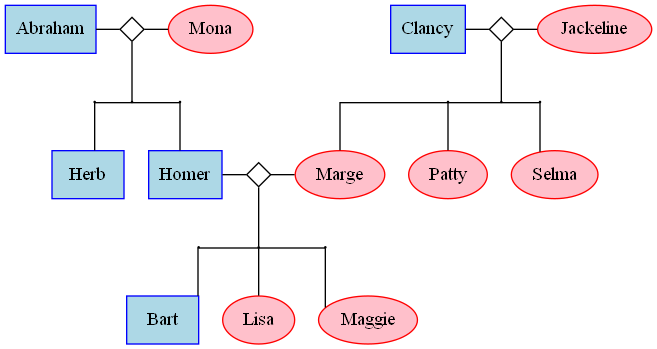

# Graphviz.Net
Graphviz.Net provides simple solution to create Graphviz Graphs


[](https://ahahn.visualstudio.com/Graphviz.Net/_build/latest?definitionId=1&branchName=master)
[](https://www.nuget.org/packages/Graphviz.Net.Generator/)


## Installation 

Install from Package Manager

    `Install-Package Graphviz.Net.Generator`


## Usage

### Simple undirected Graph


```csharp
var graph = new Graph();
graph.AddStatement(new NodeStatement("Node1"));
graph.AddStatement(new NodeStatement("Node2"));
graph.AddStatement(new EdgeStatement("Node1", "Node2"));
graph.Save("simpleGraph1.gv");
```

### Simple directed Graph


```csharp
var digraph = new DiGraph();
digraph.AddStatement(new NodeStatement("Node1"));
digraph.AddStatement(new NodeStatement("Node2"));
digraph.AddStatement(new EdgeStatement("Node1", "Node2"));
digraph.Save("simpleDiGraph1.gv");
```


### Simple Graph with Labels

Simple example with a single and a formatted multiline (html) label 



```csharp
var digraph = new DiGraph();
digraph.AddStatement(new NodeStatement("Node1")
    .WithAttribute(new LabelAttribute("Node 1")));
digraph.AddStatement(new NodeStatement("Node2")
    .WithAttribute(new LabelAttribute(new HtmlLabel(new HtmlLabelText()
    .WithTextItem(new HtmlLabelTextItem("Zeile 1")).WithTextItem(new HtmlLabelBrTextItem())
    .WithTextItem(new HtmlLabelFontTextItem("Zeile 2", Color.Red, 18))))));
digraph.AddStatement(new EdgeStatement("Node1", "Node2"));
digraph.Save("simpleDiGraphWithLabel.gv");
```


### FamilyTree Example

The following snippet shows the way to create a FamilyTree like the one shown in this post: https://stackoverflow.com/a/20822550




```csharp
var graph = new Graph();
graph.AddStatement(new AttributeStatement(AttributeType.Node, new ShapeAttribute(ShapeType.Box)));
graph.AddStatement(new AttributeStatement(AttributeType.Graph, new SplinesAttribute(SplinesType.Ortho)));

var maleAttributes = new IAttribute[] { new ColorAttribute(Color.Blue), new NodeStyleAttribute(NodeStyle.Filled), new FillColorAttribute(Color.LightBlue) };
var femaleAttributes = new IAttribute[] { new ShapeAttribute(ShapeType.Oval), new ColorAttribute(Color.Red), new NodeStyleAttribute(NodeStyle.Filled), new FillColorAttribute(Color.Pink) };
var connectorAttribtues = new IAttribute[] { new ShapeAttribute(ShapeType.Diamond), new HeightAttribute(0.25), new WidthAttribute(0.25), new LabelAttribute("") };
var childConnectorAttribtues = new IAttribute[] { new ShapeAttribute(ShapeType.Circle), new HeightAttribute(0.01), new WidthAttribute(0.01), new LabelAttribute("") };
     

// Add Persons
graph.AddStatement(new NodeStatement("Herb", maleAttributes));
graph.AddStatement(new NodeStatement("Homer", maleAttributes));
graph.AddStatement(new NodeStatement("Marge", femaleAttributes));
graph.AddStatement(new NodeStatement("Clancy", maleAttributes));
graph.AddStatement(new NodeStatement("Jackeline", femaleAttributes));
graph.AddStatement(new NodeStatement("Abraham", maleAttributes));
graph.AddStatement(new NodeStatement("Mona", femaleAttributes));
graph.AddStatement(new NodeStatement("Patty", femaleAttributes));
graph.AddStatement(new NodeStatement("Selma", femaleAttributes));
graph.AddStatement(new NodeStatement("Bart", maleAttributes));
graph.AddStatement(new NodeStatement("Lisa", femaleAttributes));
graph.AddStatement(new NodeStatement("Maggie", femaleAttributes));


// Abraham & Mona
graph.AddStatement(new NodeStatement("AbrahamMona_connector", connectorAttribtues));
graph.AddStatement(new NodeStatement("AbrahamMona_child1", childConnectorAttribtues));
graph.AddStatement(new NodeStatement("AbrahamMona_childconnector", childConnectorAttribtues));
graph.AddStatement(new NodeStatement("AbrahamMona_child2", childConnectorAttribtues));

graph.AddStatement(new RankStatement(new [] { "Abraham", "AbrahamMona_connector", "Mona" }, true));
graph.AddStatement(new RankStatement(new [] { "AbrahamMona_child1", "AbrahamMona_childconnector", "AbrahamMona_child2" }, true));
graph.AddStatement(new RankStatement(new [] { "Herb", "Homer" }, false));

graph.AddStatement(new EdgeStatement("AbrahamMona_connector", "AbrahamMona_childconnector"));
graph.AddStatement(new EdgeStatement("AbrahamMona_child1", "Herb"));
graph.AddStatement(new EdgeStatement("AbrahamMona_child2", "Homer"));


// Homer & Marge
graph.AddStatement(new NodeStatement("HomerMarge_connector", connectorAttribtues));
graph.AddStatement(new NodeStatement("HomerMarge_child1", childConnectorAttribtues));
graph.AddStatement(new NodeStatement("HomerMarge_child2", childConnectorAttribtues));
graph.AddStatement(new NodeStatement("HomerMarge_child3", childConnectorAttribtues));

graph.AddStatement(new RankStatement(new [] { "Homer", "HomerMarge_connector", "Marge" }, true));
graph.AddStatement(new RankStatement(new [] { "HomerMarge_child1", "HomerMarge_child2", "HomerMarge_child3"}, true));
graph.AddStatement(new RankStatement(new [] { "Bart", "Lisa", "Maggie" }, false));

graph.AddStatement(new EdgeStatement("HomerMarge_connector", "HomerMarge_child2"));
graph.AddStatement(new EdgeStatement("HomerMarge_child1", "Bart"));
graph.AddStatement(new EdgeStatement("HomerMarge_child2", "Lisa"));
graph.AddStatement(new EdgeStatement("HomerMarge_child3", "Maggie"));


// Clancy & Jackeline
graph.AddStatement(new NodeStatement("ClancyJackeline_connector", connectorAttribtues));
graph.AddStatement(new NodeStatement("ClancyJackeline_child1", childConnectorAttribtues));
graph.AddStatement(new NodeStatement("ClancyJackeline_child2", childConnectorAttribtues));
graph.AddStatement(new NodeStatement("ClancyJackeline_child3", childConnectorAttribtues));

graph.AddStatement(new RankStatement(new [] { "Clancy", "ClancyJackeline_connector", "Jackeline" }, true));
graph.AddStatement(new RankStatement(new [] { "ClancyJackeline_child1", "ClancyJackeline_child2", "ClancyJackeline_child3" }, true));
graph.AddStatement(new RankStatement(new [] { "Patty", "Selma", "Marge" }, false));

graph.AddStatement(new EdgeStatement("ClancyJackeline_connector", "ClancyJackeline_child2"));
graph.AddStatement(new EdgeStatement("ClancyJackeline_child1", "Marge"));
graph.AddStatement(new EdgeStatement("ClancyJackeline_child1", "Patty"));
graph.AddStatement(new EdgeStatement("ClancyJackeline_child3", "Selma"));


// Save the Family Tree
graph.Save("FamilyTreeExample.gv");
```
 


